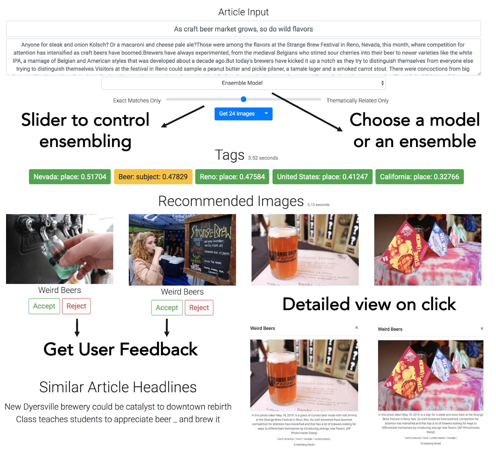

## AC297r Capstone Project: A Text-to-Image Recommendation System for the Associated Press
Karina Huang, Dianne Lee, Abhimanyu Vasishth, Phoebe Wong.
TF: Isaac Slavitt

### About the Project

We create a Text-to-Image Recommendation system that takes the text and headline of an article and recommends a set of best matching photos from AP’s archive.



### Deliverables

View our [Poster](https://github.com/phoebewong/AC297r_2019_Associated_Press/blob/master/submissions/final-presentation/ap_capstone_final_poster.pdf) and our [Final Presentation](https://github.com/phoebewong/AC297r_2019_Associated_Press/blob/master/submissions/final-presentation/ap_capstone_final_presentation.pdf) in the `submissions` folder. In addition, we also wrote a blog on Towards Data Science that you can read [here](todo).

--------

### How to Install and Run the Project

#### If you don't have Python 3.6.9

1. `brew install pyenv`
2. `pyenv install 3.6.9`
3. `pyenv local 3.6.9`
4. `PATH="~/.pyenv/versions/3.6.9/bin:${PATH}"`

#### Create a virtual environment (Python 3.6.9)

1. `python3 -m venv capstone-test`
2. `source capstone-test/bin/activate`
3. `python --version` should be 3.6.9
4. `pip install --upgrade pip` optionally
5. `pip list` lists the following:

```
pip version 19.3.1
setuptools version 40.6.2
```

#### Clone our Github repository

1. `git clone https://github.com/phoebewong/AC297r_2019_Associated_Press.git`
2. `cd AC297r_2019_Associated_Press/`

#### Installing libraries

1. `pip3 install -r requirements.txt`
2. `pip list` will now list all our requirements
3. `python -m spacy download en` to install the spacy model

#### Download Stanford parser (optional: only if you want to run the Image tag importance ranking source code for new images)

1. download Stanford Parser version 3.9.2 from https://nlp.stanford.edu/software/lex-parser.shtml#Download
2. unzip the downloaded folder as `stanford-parser-full-2018-10-17/`
3. place folder in the main directory

#### Download pre-trained Universal Sentence Encoder

1. download version 4 of the pre-trained USE from https://tfhub.dev/google/universal-sentence-encoder/4s
2. unzip the downloaded file and rename model directory as `use_model_4/`
3. place model directory in `data/`


#### API keys

There are two sensitive files: one is our API key for the taxonomy data and the second is the API key for getting data from our on-demand queue given to us by the AP. These are the instructions for the the first file

1. Place the `tagging_api_password.ini` file in `src`
2. Rename the above file `password.ini`
3. Copy the above file to `src/taxonomy_data` and keep the name of the file the same (both files should be called `password.ini`

These are the instructions for the second set of files

1. Place the `on_demand_password.ini` file in `src/data_extraction` and rename the file `password.ini`

If you are using your own files, make sure you call them `password.ini` and place them in the appropriate directories. The format of the file is as follows:

```
[key]
apikey = yourApiKeyHere
```
#### Getting the data

1. Download the data (about 15gb) from google drive [link](https://drive.google.com/file/d/12vmDT-GueP2-DooyaeQwEFrFz9K7SS_7/view?usp=sharing)
2. Unzip the data within the main directory of the GitHub repository. There should be a `/data` folder now.
3. If there is a folder called `__MACOSX` now created in the root directory of the github repository alongside the `data` directory, this folder can be deleted using `rm -rf __MACOSX`.
4. Copy the folder `src/data/preview` and `src/data/thumbnail` into `src/ui/static/img`
5. A sanity check: `ls src/ui/static/img` should show the folders `thumbnail`, `preview` and `spinner.gif`

#### Running the app

Run `make api` and go to: `http://127.0.0.1:8000/` to test it out

#### Testing

Run `pytest test_project.py` from the project root.

--------

### Project Organization

#### Data

This directory includes all data and reference files we have worked with in completing the Capstone project. Below we highlight some important directories / files that are vital to our working recommendation system and UI.


* `img_idx.json`

  All matrices saved in this directory have the shape (#images, #tags), and were made according to this image id reference file. We use this file to match matrix row ids back to image ids.

* `tag_idx.json`

  Reference file for matching column ids in `normalized_imp_matrix.npz` back to tag.

* `place_tag_idx.json`

  Reference file for matching column ids in `image_place_tag_ind_matrix.npz` back to place tags.

* `place_tag_list.txt`

  Reference file for making place tag indictor vector for input articles. This file is used in Text-to-Text Recommendation with USE Embeddings to compare article and image place tags.

* `normalized_imp_matrix.npz`

  Sparse matrix of image tag importance scores.

* `image_place_tag_ind_matrix.npz`

  Sparse binary indicator matrix of image place tags. This file is used in Text-to-Text Recommendation with USE Embeddings to compare article and image place tags.

* `img_USE_embedding.npz`

  Compressed matrix of image headline USE embeddings.

* `clean_data/`

  Directory contains all cleaned data in the form of csv files. Removed article and media file ids are recorded in `clean_data/clean_history/`.

* `logged_data/`

  We currently log data about images that are 'liked' or 'disliked' on the UI in json files in this folder. This folder is currently empty but will populate with entries once the UI is run for 2 or more articles.

#### Src

Below we provide an overview of the structure of our `src` directory. Note that we only highlight the important files and procedures that enable our recommendation system. For implementation details, please refer to the comments within individual `.py` files inside the subdirectories.

* `constants.py`

  Constant variables reference file. Variables include directory paths, filenames, etc.

* `api_helper.py`

  Api helper functions such as functions that get the headline of an article or the images associated with an article.

* `tagging_api.py`

  Tagging api connection source code

* `data_extraction/`

  The data extraction folder contains our source files used for extracting data from our on-demand-queue given to us by the Associated Press. In order to run any of these files you must have a valid API key. Check out the **API keys** section of the previous section for more information. The data has already been extracted so you do not need to run any files in this section to make the UI work. To run the files, follow these steps:

  1. `cd data_extraction`
  2. `python main_extraction.py` to extract the json files from our on-demand queue and save it to the data folder (subfolders `full`, `article` and `image`)
  3. `python full_text_extraction.py` to extract the full text from each article and save it to the data folder (subfolder `full_text`)
  4. `python image_extraction.py` to extract the preview and thumbnail jpg images and save it to the data folder (subfolder `preview` and `thumbnail`)


* `metadata/`

  Directory for processing downloaded metadata from Media API.

  To process metadata:
  1. run `extract_metadata.py` to extract and save metadata from json files to csv files


* `data_cleaning/`

  Directory contains source code for data cleaning.

  To clean data:
  1. run `duplicate_images.py` to check and save all duplicated image ids
  2. run `clean_data.py` to clean data


* `taxonomy_data/`

  Directory for extracting taxonomy data.

  *Note: this directory may be ignored as taxonomy data was not used in the project.*


* `image_tir/`

  Directory for image tag importance ranking.

  *Note: running the following code will take a really long time: ~ 3 days + 2 nights. `data/` should already contain outputs from the following code.*

  To rank image tags:
  1. run `get_tag_importance.py` to measure and save all image ids and tags as dictionaries in .json files
  2. run `get_importance_matrix.py` to process and save image tag importance scores in a matrix
  3. run `normalize_matrix.py` to normalize image tag importance scores for recommendation

  To get image place tags:
  1. run `get_place_tags.py` to find and save a binary indicator matrix of image place tags.


* `nlp_util/`

  TODO


* `preprocessing/`

  Directory contains miscellaneous preprocessing code files that further prepare the cleaned data for modeling.

  *  `parse_grammar.py` contains grammar parsing source code for image tag importance ranking
  *  run `USE_embeddings.py` to retrieve and save all image headline USE embeddings as a matrix


* `models/`

  Directory includes all recommendation models implemented.

  * Tag-to-Tag Recommendation:
    * KNN model [Baseline]: `knn_model.py`
    * Word2vec Embeddings: `soft_cosine_model.py`
  * Ranked Tag Recommendation: `t2i_recsys.py`
  * Text-to-Text Recommendation:
    * GloVe Embeddings: `avg_embeddings_model.py`
    * USE Embeddings: `USE_model.py`


* `ui/`

  The structure of this folder is as follows:

      ├── src
        ├── ui
          ├── static
            ├── css
              ├── app.css
            ├── img
              ├── preview
              ├── thumbnail
              ├── spinner.gif
            ├── js
              ├── app.js
            ├── favicon.ico
          ├── templates
            ├── index.html
          ├── __init__.py
          ├── app.py

--------

#### Acknowledgements

We would like to acknowledge our mentors Pavlos Protopapas and Isaac Slavitt at Harvard for their guidance throughout the semester. We would also like to thank Veronika Zielinska and David Fox from the Associated Press for their support.

<p><small>Project based on the <a target="_blank" href="https://drivendata.github.io/cookiecutter-data-science/">cookiecutter data science project template</a>. #cookiecutterdatascience</small></p>
